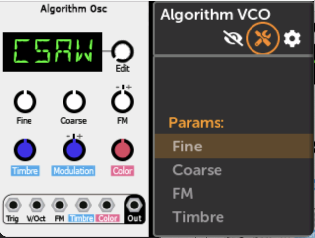
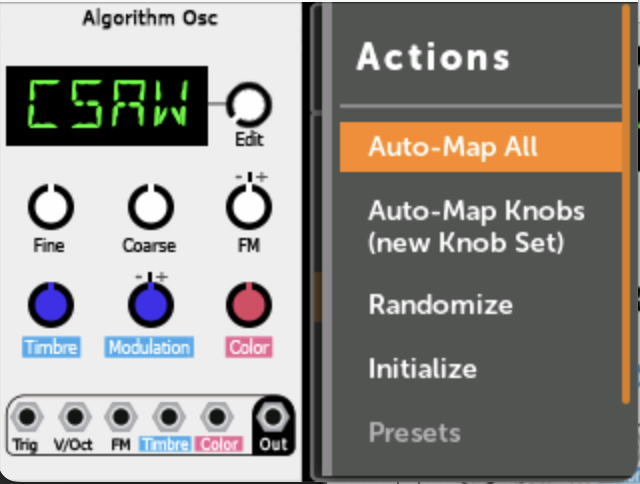

# モジュールアクションメニュー

## 概要

モジュールアクションメニューは、パッチ内のモジュールをクリックし、上部のツールアイコンを選択することでアクセスできます。

## 利用可能なアクション

### Auto-map All

表示される順序ですべてのノブとジャックのマッピングを試みます。「既存のマップは保持され、必要に応じて新しいノブセットが作成されます。」ジャックはIn 1-6とOut 1-8にマッピングされ、すでにマッピングされている接続はスキップされます。モジュールの試用やシングルモジュールパッチに最適です。

### Auto-map knobs (new Knob Set)

ジャックではなく、ノブマッピングのみで新しいノブセットを作成します。「新しいノブセットにはモジュール名が付けられます（例：「EnOsc」や「Plateau」）。」最大12コントロールに制限されています。

### Randomize

「すべてのパラメータの値をランダム化します。」注意：VCV Rackにはランダム化からのパラメータ除外がありますが、MetaModuleではまだ実装されていません。

### Initialize

マッピングやケーブルを削除せずに、モジュールをデフォルト状態にリセットします。動作はモジュールタイプによって異なります。

### Presets

モジュールのファクトリープリセットを参照します（利用可能なものがない場合は無効）。ユーザー作成のプリセットはGUIを通じて現在サポートされていませんが、手動のコマンドライン方法は存在します。

### MIDI Assign

パラメータをMIDI CCまたはMIDI Noteゲートイベントにマッピングできるようにします。クイックアサインジャックのドキュメントを参照してください。

### Delete

「パッチからモジュールを削除し、すべてのケーブルとマッピングを削除します。これは元に戻せません。」モジュールを復元するにはパッチをリバートできます。
