# はじめに

## パネルを知る

MetaModuleの物理的なレイアウトとコントロールについては、フェースプレート概要図を参照してください。

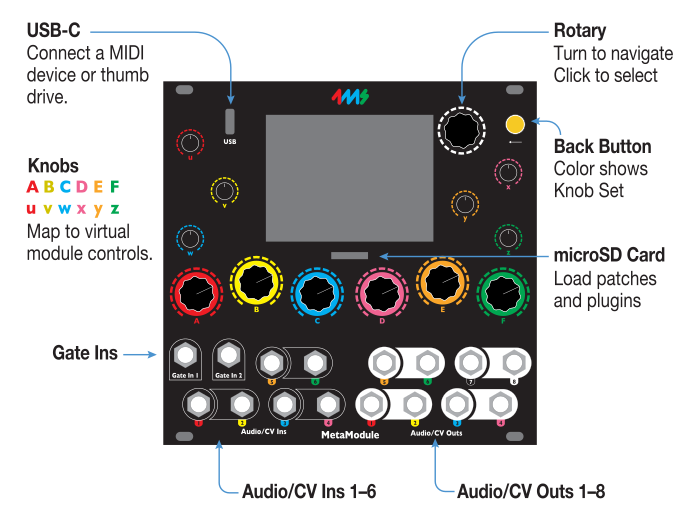

| 英語                            | 日本語                                   |
| ------------------------------- | ---------------------------------------- |
| Knobs A B C D E F u v w x y z   | ノブ A B C D E F u v w x y z             |
| Map to virtual module controls. | 仮想モジュールのコントロールにマッピング |
| Gate Ins                        | ゲート入力                               |
| Audio/CV Ins 1–6                | オーディオ/CV入力 1–6                    |
| Audio/CV Outs 1–8               | オーディオ/CV出力 1–8                    |
| Back Button                     | バックボタン                             |
| Color shows Knob Set            | 色でノブセットを表示                     |
| microSD Card                    | microSDカード                            |
| Load patches and plugins        | パッチとプラグインを読み込み             |
| USB-C                           | USB-C                                    |
| Rotary                          | ロータリーエンコーダー                   |

## 電源ケーブルの接続

**電源ケーブルをMetaModuleに接続します。赤いストライプを下にしてください。** もう一方の端をEurorack電源に接続します。

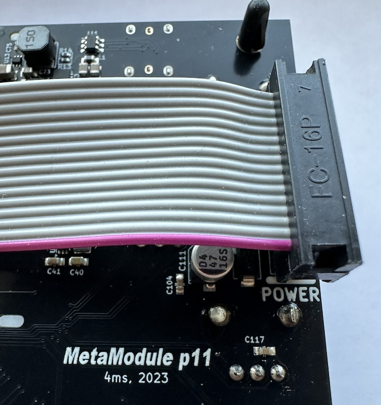

## パッチの再生方法

3つのステップで行います：

1. メインメニューで `Load Patch` をクリック

2. パッチセレクターからパッチを選択

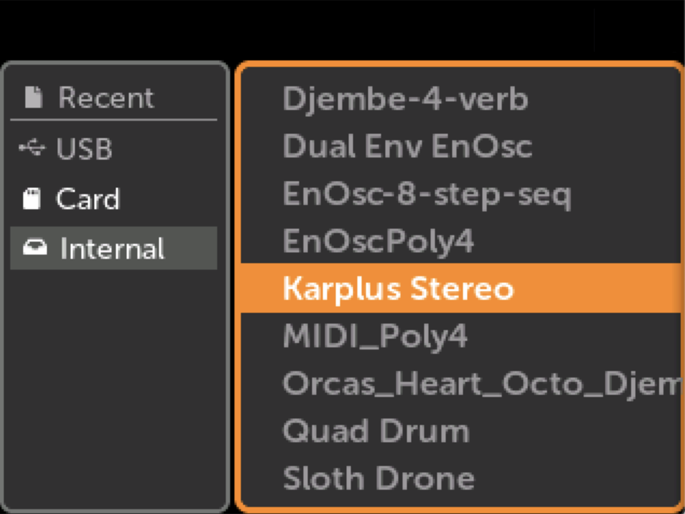

3. 再生アイコンをクリックして開始

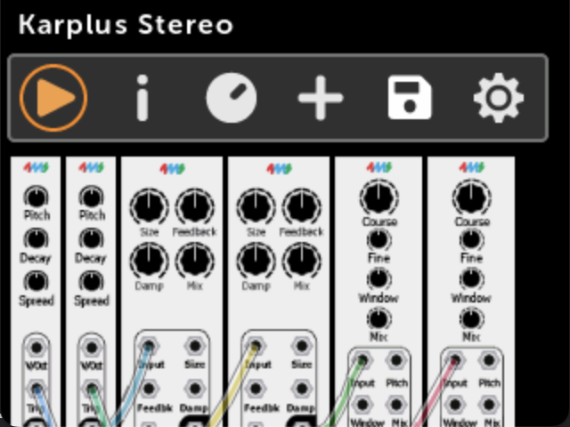

## 新しいパッチの作成方法

ステップバイステップガイド：

1. メインメニューから新しいパッチを作成

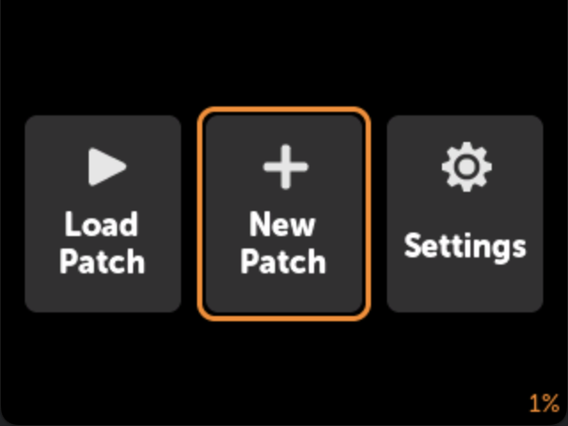

2. モジュールを追加（例：Ensemble Oscillator）

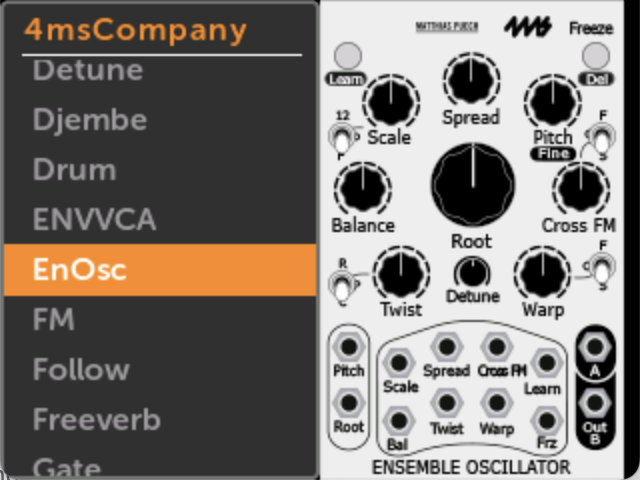

3. モジュールをクリックして操作

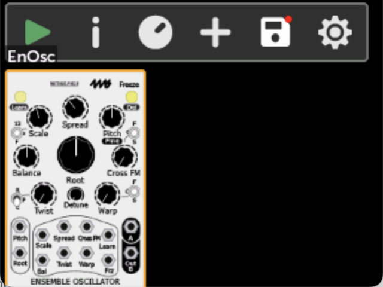

4. アクションメニューからAuto-Mapを選択

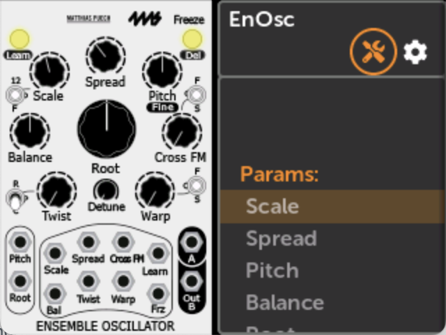

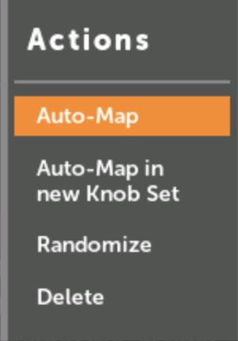

Auto-Mapは**物理的なノブとジャックをEnOscの仮想ノブ、スイッチ、ジャックにマッピング**します。

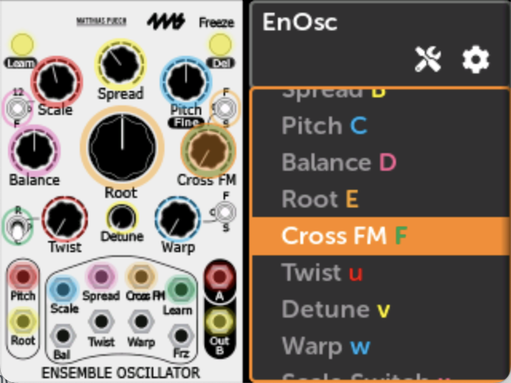

5. `+` ボタンで追加のモジュールを追加

## ファームウェアのアップデート方法

1. メインメニューのSettingsにアクセス

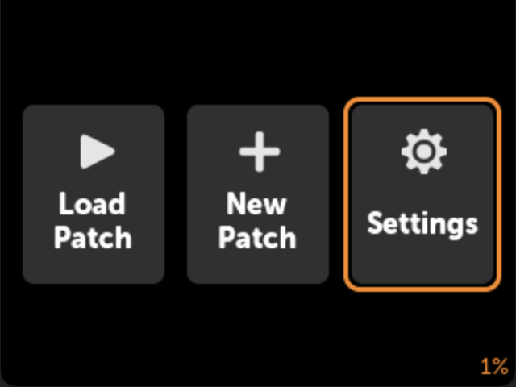

2. Updateをクリック

3. ファームウェアをUSBまたはSDカードにダウンロード

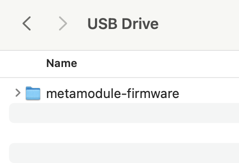

4. ドライブを挿入してUpdate Firmwareボタンをクリック

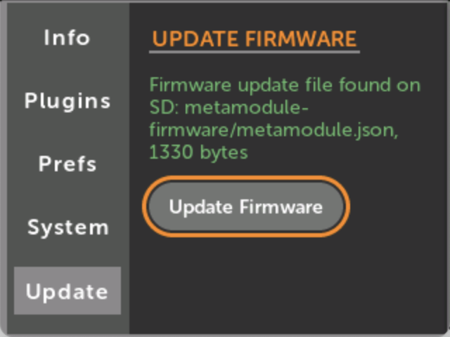

**重要：ファームウェアとプラグインを同時にアップグレードする場合は、必ずファームウェアを先にアップグレードしてください。** 新しいプラグインは更新されたファームウェアを必要とする場合があります。
