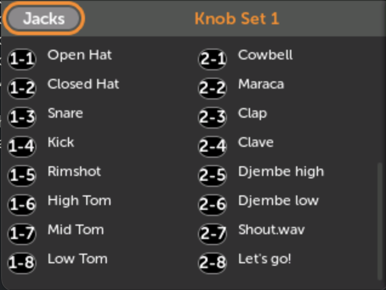
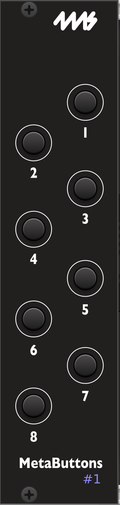
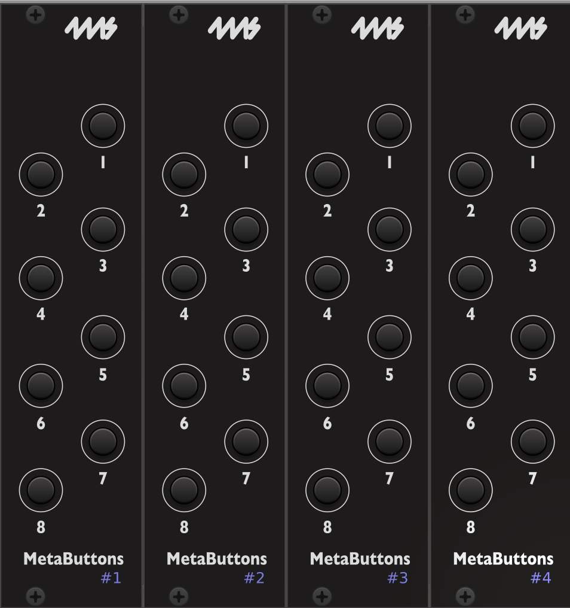
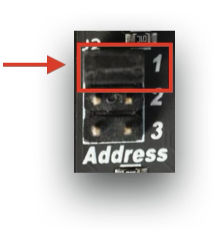
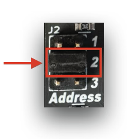
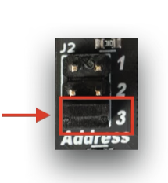
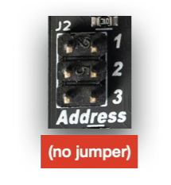

# MetaButtons エクスパンダー

## 概要

このマニュアルでは、MetaModule用のMetaButtonsエクスパンダーモジュール（ファームウェアv2.1.6）のセットアップ、使用方法、デイジーチェーン機能について説明します。

## セットアップ

初期ハードウェアセットアップについては、4ms Companyから入手可能なPDFクイックスタートガイドを参照してください。

## 基本的な使い方

**マッピングの作成：** ボタンはノブマッピングと同様に仮想パラメータにマッピングされ、手動作成とクイックマップショートカットの両方をサポートします。

**ノブセットとの統合：** 「ボタンマップはノブセットに属します。ノブセットを変更すると、ノブマッピングが変更されるのと同様に、ボタンマッピングも変更されます。」

**キャッチアップモード：** ボタンマッピングはノブキャッチアップモードの制限をバイパスします。ボタンを押すと常にマッピングされたパラメータが更新されます。

**ボタンの命名規則：** ボタンはモジュール番号（1-4）とボタン番号（1-8）を使用した命名スキームに従います。例えば、モジュール1の最初のボタンはB1-1です。

**トグルモード：** ボタンは2つの状態を切り替えるように設定でき、Min/Max値を調整して細かい制御が可能です。

## VCV Rack統合

VCV RackのMetaButtonsモジュールを使用してボタンマッピング付きのパッチを作成でき、マッピング状態を示すビジュアルフィードバックがあります。

モジュール番号は物理的なジャンパー位置（1-4）と一致する必要があります。

## デイジーチェーン

直列に接続された最大4つのMetaButtonsモジュールをサポートします。各モジュールには以下が必要です：

- 「Toward MetaModule」ヘッダーから前のモジュールの「Toward Expanders」ヘッダーへのケーブル接続
- スロット番号1-4を割り当てるための特定の位置へのジャンパー配置（上、中、下、または取り外し）

**ジャンパー位置：**

**注意：** 重複がなければ、スロット割り当ての順序は関係ありません。
