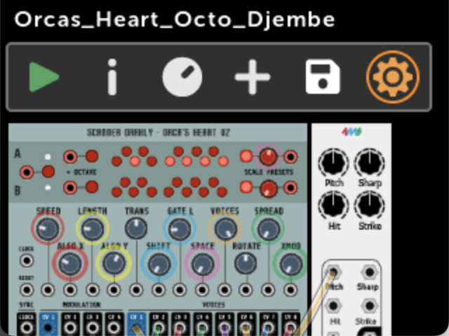
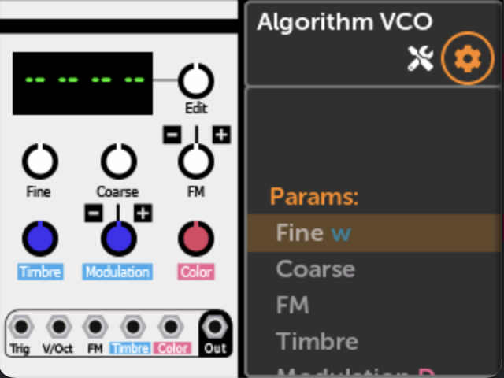
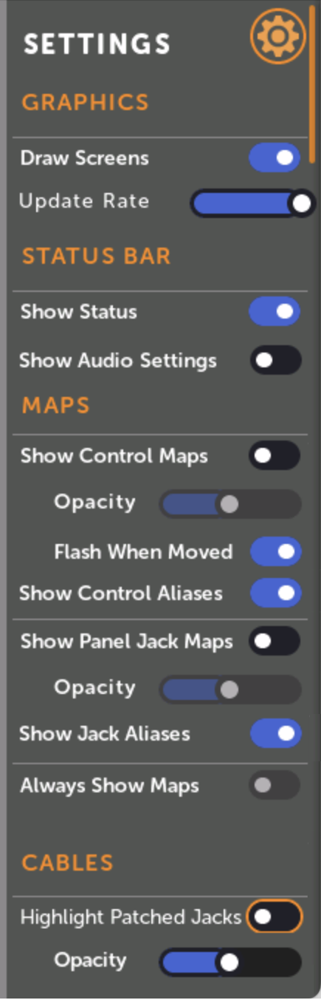
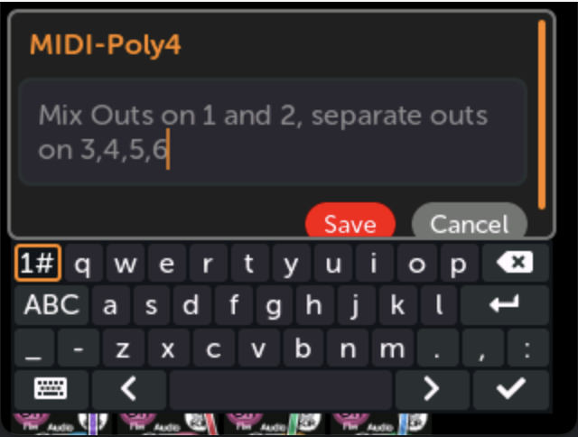
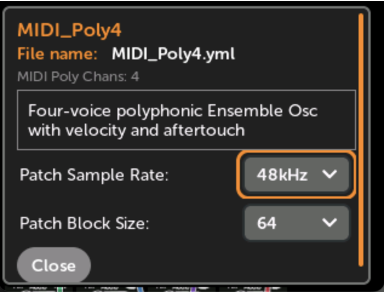
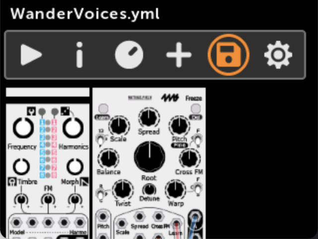

# パッチ/モジュール設定

## 概要

このドキュメントでは、MetaModuleシンセサイザープラットフォームの表示設定とファイル管理について説明します。

設定にアクセスするには、パッチビューの歯車アイコンをクリックします。

## モジュールとパッチの表示設定

### GRAPHICS

モジュール上の動的なビジュアル要素のレンダリング方法を制御します：

- **Draw Screens**: グラフィック画面レンダリングの切り替え。無効にすると応答性が向上する場合があります
- **Update Rate**: フレームレートを制限してCPU負荷を軽減（60Hzから低いリフレッシュレートまで調整可能）

### STATUS BAR

コーナー位置にCPU使用率とオプションのオーディオ情報を表示：

- **Show Audio Settings**: サンプルレートとブロックサイズを表示（例：「48k/128 33%」）
- **Show Status**: スクロール中もステータスバーを最上位レイヤーに表示

### MAPS

コントロールとジャックマッピングの視覚的表現を管理：

- **Control Maps**: マッピングされたコントロールの周りに色付きリングを表示。不透明度と動きでフラッシュするオプションを含む
- **Jack Maps**: マッピングされたジャックに色付きの円を表示。オプションで番号付け
- **Always Show Maps**: 非アクティブなパッチを表示するときにマップを非表示
- **Show on All Modules**: パッチビュー全体にマップ表示を拡張

### CABLES

- **Show Cables**: パッチビューでのケーブル表示の切り替え
- **Highlight Patched Jacks**: モジュールビューで接続されたジャックを示す色付きの四角を表示
- **Opacity**: ケーブルとハイライトの透明度を調整可能

## パッチ情報

情報アイコンからアクセス。名前、ファイル名、MIDIチャンネル、説明、オーディオ設定を含むパッチメタデータを表示します。

説明は編集可能で、推奨サンプルレートとブロックサイズを設定できます。

## パッチファイルメニュー

**Save**、**Duplicate**、**Move/Rename**、**Revert/Reload**、**Startup Patch**、**Delete** のオプションを提供します。

### ファイル名の要件

「ファイル名に使用できる文字：0-9 A-Z ! # $ % & ' ( ) - @ ^ \_ ` { } ~ + , ; = [ ] および拡張文字」

スペースとドットはパスの末尾以外で使用可能。末尾のスペース/ドットは無視されます。
