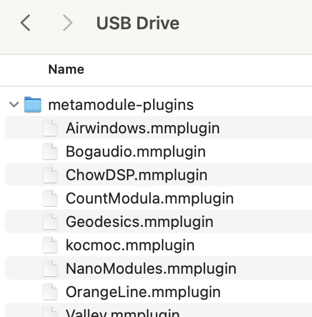
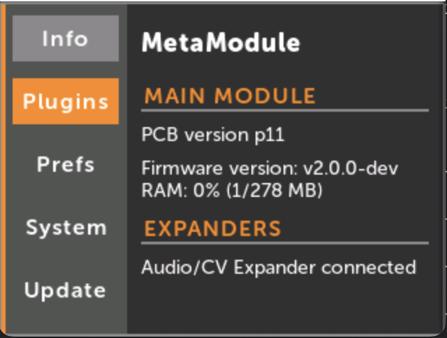
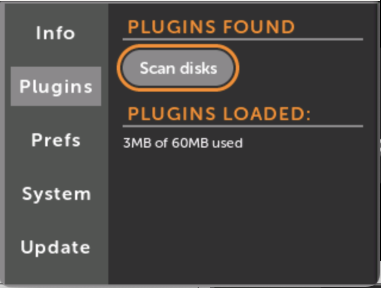
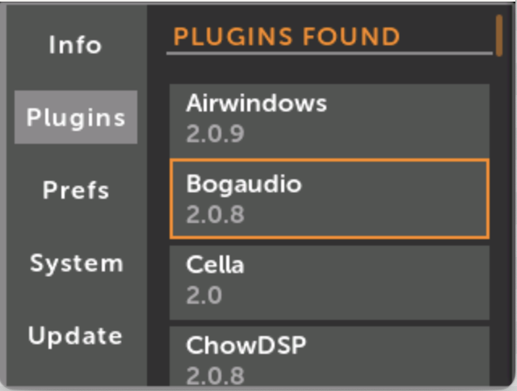
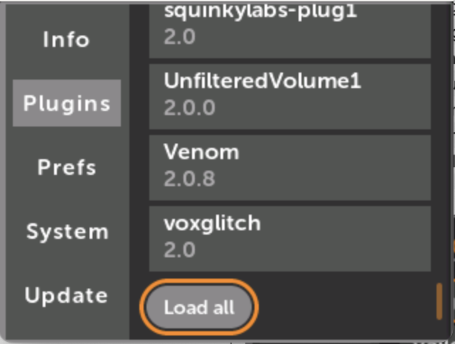
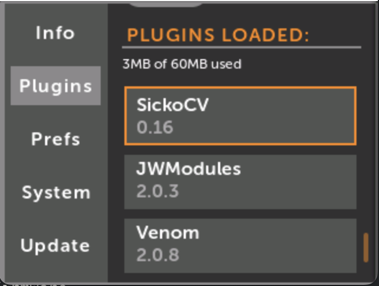
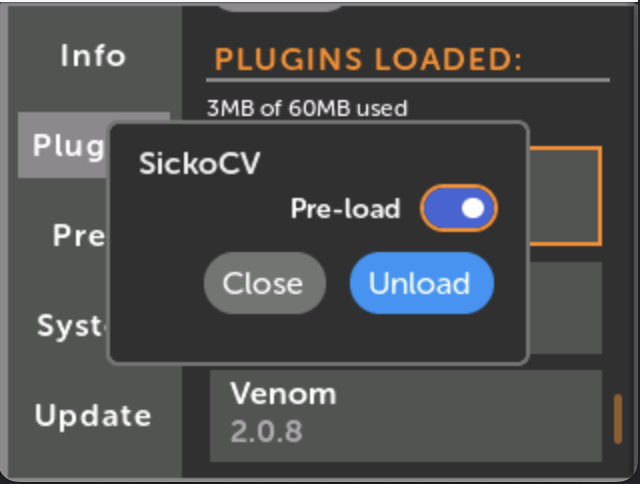
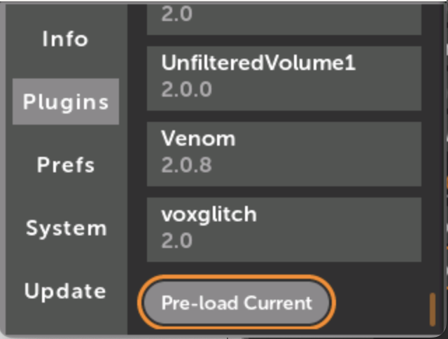
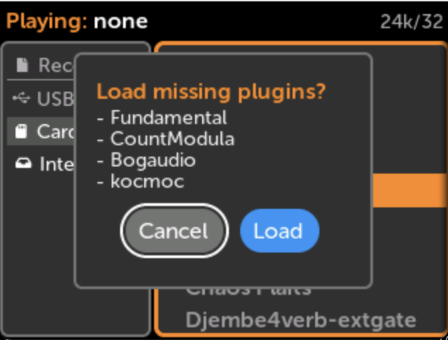
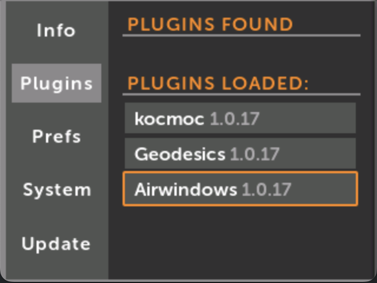

# プラグインの使い方

## 概要

このドキュメントでは、MetaModuleシンセサイザーでのプラグインのインストール、管理、およびロード方法について説明します。

## プラグインのインストール

プロセス：

1. Pluginsリンクからプラグインをダウンロードしてアーカイブを解凍
2. `metamodule-plugins` フォルダをUSBドライブまたはmicroSDカードにコピー

3. ドライブをMetaModuleに挿入
4. Settings > Plugins > Scan disksに移動

5. 個別のプラグインを選択してロードするか、「Load All」をクリック

個別の `.mmplugin` ファイルは、`metamodule-plugins` フォルダまたはストレージデバイスのルートディレクトリに配置できます。

## プラグインの事前ロード

起動時に自動的にロードするようにプラグインを設定できます。この機能には、電源投入時にプラグインファイルを含むストレージデバイスが存在する必要があります。事前ロード状態はPluginsタブを終了するときに保存されます。

「Pre-load Current」オプションを使用すると、次回起動時に現在ロードされているプラグインセットを自動的にロードできます。

## プラグインの自動ロード

この「遅延ロード」機能は、必要なときにのみプラグインをロードします。Settings > Preferences > Missing Pluginsで設定可能で、「Ask」または「Always」オプションで不足しているプラグインをロードできます。

パッチファイルを開くときに、システムはストレージデバイスをスキャンして必要なプラグインを探します。

自動ローダーがアクティブになるタイミング：

- Patch Selectorからパッチを開くとき
- パッチをリロードまたはリバートするとき
- 一時停止中のパッチを再生するとき
- Wi-Fi経由でパッチを更新するとき

## プラグインバージョン

ロードされたプラグインのバージョン情報を確認できます。

## プラグインモジュールの表示

新しいパッチを作成し、プラグイン名を選択し、個々のモジュールをクリックしてフルスクリーンプレビューを表示するか、現在のパッチに追加することで、利用可能なモジュールを閲覧できます。
