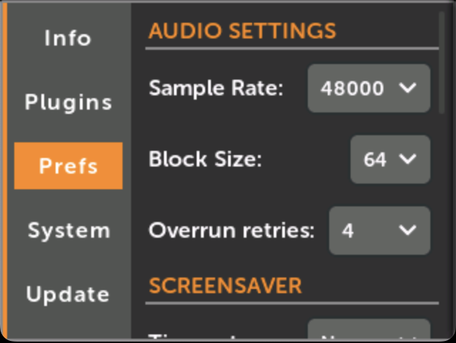
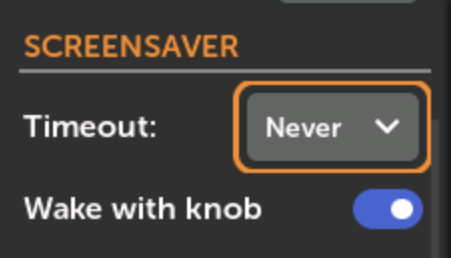
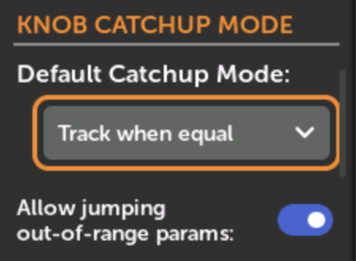
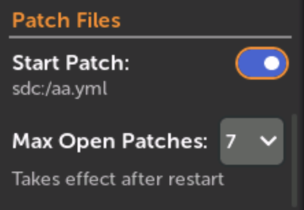
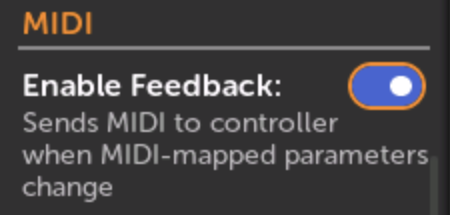

# 環境設定

## 概要

このページでは、メインメニューのSettings > Prefsからアクセスできる、MetaModuleファームウェアv2.1.6の環境設定について説明します。

## オーディオ設定

オーディオ処理の設定オプション：

- **Sample Rate**: 24000、36000、48000、96000 Hzから選択。「より高い値は一般的に品質が良いですが、CPUをより多く使用します。」
- **Block Size**: 16〜512サンプルのオプション。低い値はレイテンシーを減らしますが、モジュールの互換性とCPU効率は実装によって異なります
- **Patch Override**: ロード時にパッチがオーディオ設定を変更することを許可
- **Overrun Retries**: パッチを停止する前の1秒あたりのオーディオグリッチの許容度を決定

## スクリーンセーバー

非アクティブ時にディスプレイが暗くなりますが、オーディオや外部信号には影響しません。オプションでノブ操作で画面をウェイクできます。

## ノブキャッチアップモード

物理ノブと仮想ノブの位置のずれを処理：

- **Track if knob moves**: 「物理ノブを回すとすぐに仮想ノブの値がジャンプします。」
- **Track when equal**: 位置が一致すると同期が開始
- **Linear Fade**: 物理的な動きに比例して仮想ノブが変化

Track when equalモードで範囲外のパラメータをジャンプさせる補助オプションがあります。

## パッチファイル設定

- **Startup Patch**: モジュール起動時にロードするデフォルトパッチを指定
- **Max Open Patches**: 同時に開けるパッチの数を制限。最大数を超えると最も古い未保存のパッチが自動的に閉じられます

## MIDI

「MIDIフィードバックは、MIDIマッピングされたノブの値をMIDIコントローラーに送り返す機能です。」これにより、パッチの変更やパラメータの更新時に同期が維持されます。

## 不足プラグイン

利用できないモジュールの3つの検索動作：

- **Ask**: 検索前にユーザーに確認
- **Always**: 自動検索とロード
- **Never**: 不足モジュールを無視
