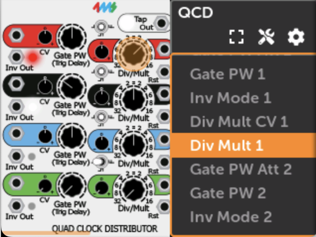
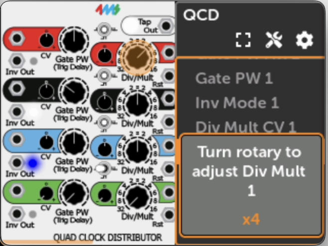

# ショートカット

## 概要

このドキュメントページでは、MetaModule UIインターフェースで利用可能な時間節約ショートカットについて説明します。

## メインショートカット

### ノブセットショートカット

Backボタンを押しながらエンコーダーを回すと、ノブセット（1-8）を素早く切り替えられます。ポップアップにアクティブなセット名が表示され、Backボタンの色は現在のノブセット番号を示します。

### クイックマップショートカット

以下の方法でパラメータを素早くマッピングできます：

1. 目的のパラメータにスクロール

2. ロータリーエンコーダーを押し続けながらノブを動かす
3. ノブ名が表示されたらリリース

「ロータリーを押しながらBackボタンをタップするとマッピングを削除できます。」

### クイックMIDIマップショートカット

MIDI Assignモードを使用してMIDI CCまたはNoteマッピングを作成：

1. モジュールアクションメニューでMIDI Assignを有効化

2. 対象パラメータにスクロール

3. ロータリーを押し続けながらMIDI CCまたはNote信号を送信
4. MIDIイベントが表示されたらリリース

### クイックジャックアサイン

ロータリーエンコーダーを押して回すと、仮想ジャックをパネルジャックにパッチできます。回転するたびに異なる利用可能なパネルジャックが選択されます。

### マッピング削除ショートカット

「削除したいマッピングのあるパラメータにスクロールします。ロータリーを押しながらBackボタンをタップします。」

### クイックパラメータ調整

「ロータリーエンコーダーを回しながら押し込む」と、マッピングされたコントロールがなくてもノブ、スイッチ、ボタンの値を調整できます。

