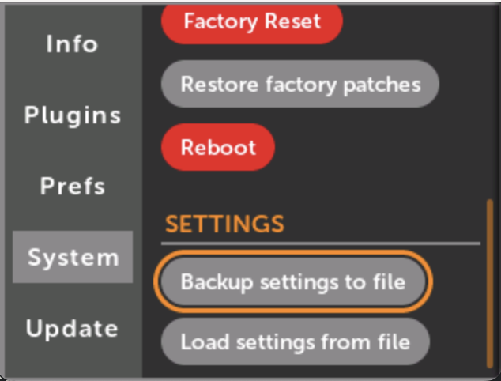

# トラブルシューティング

## 概要

このドキュメントでは、通常のファームウェアアップデートが失敗した場合のMetaModuleの起動トラブルシューティング手順について説明します。

## USB DFUブートローダー

モジュールが正常に起動しない場合に、USB経由でファームウェアをインストールする方法：

1. 最新のファームウェアをダウンロードして解凍（`main.uimg`ファイルを見つける）
2. USBデータケーブルをモジュールに接続
3. ロータリーエンコーダーを押しながら電源を入れ直す
4. モジュールがブートローダーモードに入る（ボタンが緑色に点滅）
5. Chromeブラウザを使用してWeb DFUツールにアクセス
6. STMデバイスを選択して`main.uimg`ファイルをアップロード
7. 完了を待つ（エラーメッセージは想定内であり正常）
8. プラグを抜いてモジュールの電源を入れ直す

## SDカードリストア

フォーマットされたSDカード（最小2GB）を使用して破損したブートローダーを復元するために予約されています：

- リストアイメージ（`metamodule-restore-v1.6.4.img`）をダウンロードして解凍
- Balena Etcherを使用してイメージを書き込む
- SDカードを挿入してBOOT0_2 DIPスイッチを切り替える
- ブートして通常のアップデート手順を実行し、ブートローダーを再インストール
- その後スイッチをリセットし、内部メモリからのブートを確認

## 設定ファイルのバックアップ/リストア

トラブルシューティングやデータ保存のために、環境設定と構成を`settings.yml`ファイルとして外部ストレージにエクスポートまたはインポートできます。

