# ジャックとケーブルの使い方

## 概要

このドキュメントでは、MetaModuleでのケーブルパッチングについて説明します。MetaModuleは2種類のケーブルタイプで動作します：仮想モジュール間の内部ケーブルとパネルジャックマッピングです。「現在のMetaModuleバージョンでは、モノフォニックケーブルのみがサポートされています。」

## ケーブルのパッチ方法

### モジュール間のパッチ

プロセスは3つのステップで構成されます：

1. **ケーブルを開始** - ジャックをクリックして「New Cable」を選択（入力または出力から可能）

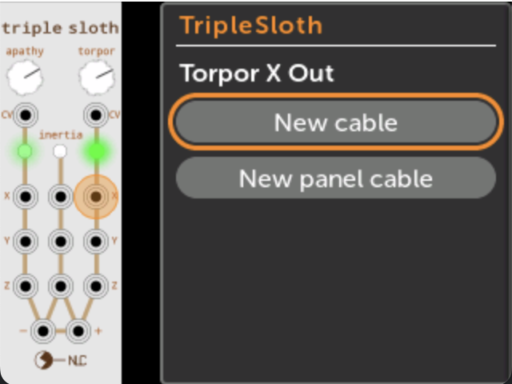

2. **ナビゲートして接続** - 対象モジュールを見つけ、目的のジャックを選択

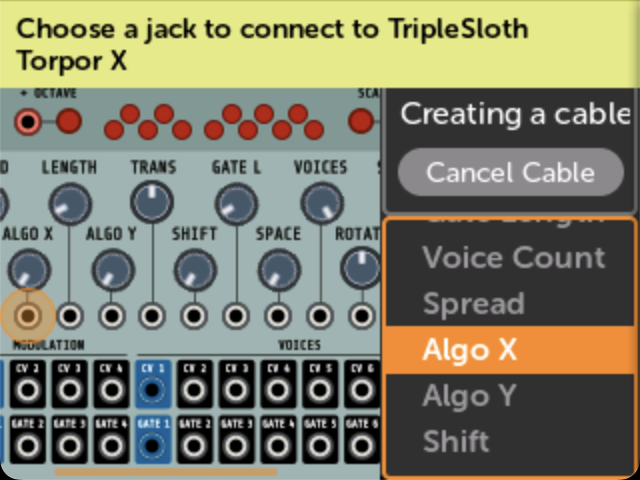

3. **完了** - 接続が確立されます

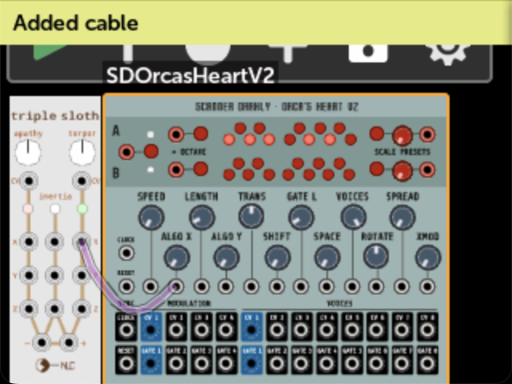

注意：物理パネル入力は仮想モジュールへの出力として機能するため、複数の出力を単一の入力ジャックに接続することはできません。

### パネルジャックへのパッチ

仮想モジュールジャックを物理パネルジャックに接続するには：

- ジャックをクリックして「New Panel Cable」を選択

- ドロップダウンメニューから利用可能なパネルジャックを選択

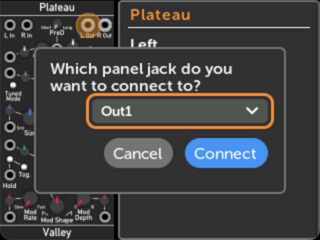

- 接続（パネル出力は既存のケーブルを切断、入力はスタック可能）

### クイックアサイン方法

ジャックを表示しながらロータリーエンコーダーを押して回すと、利用可能なパネルジャック割り当てを素早く切り替えられます。

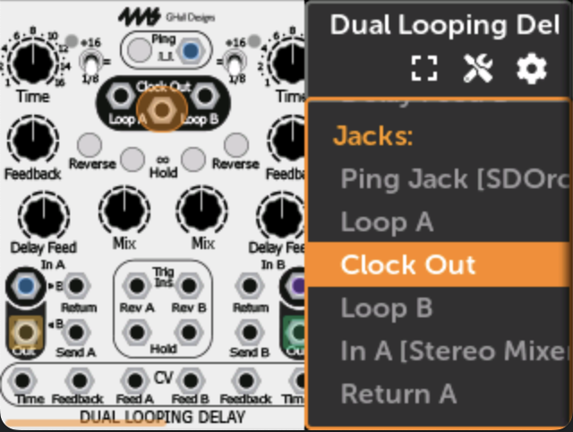

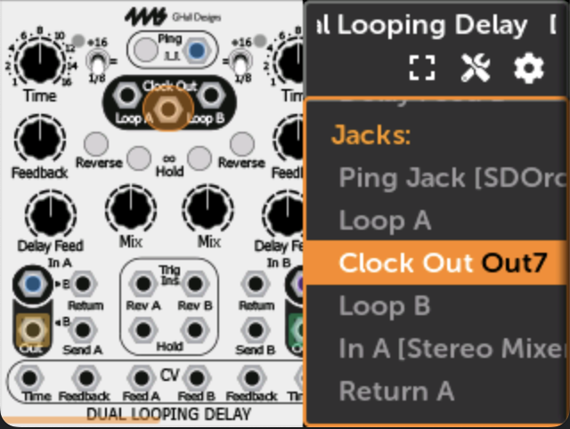

押しながらBackをタップすると割り当てが削除されます。

### カスタムジャック名

ジャックをクリックし、「Connected To:」ボックスのパネルジャックマッピングを選択することでエイリアスを作成できます。

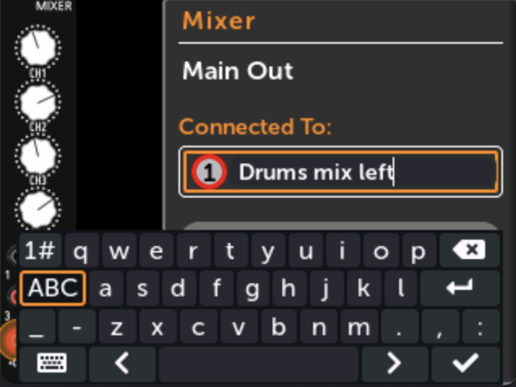

エイリアスはパッチと共に保存され、Jacksページに表示されます。

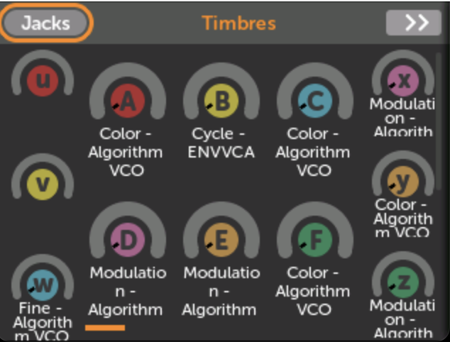

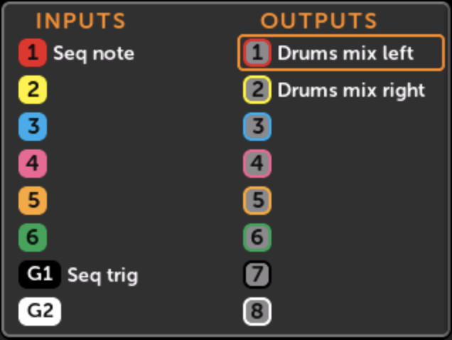

### すべてのマッピングを表示

ノブセットページからJacksボタンをクリックすると、完全なジャック割り当てにアクセスできます。

### ケーブルの切断

ジャックをクリックして「Disconnect」を選択すると、すべてのケーブルが削除されます。

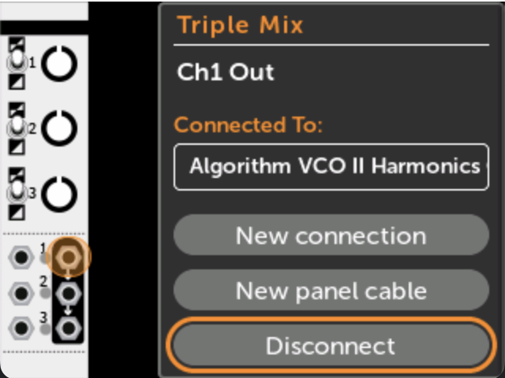

スタック接続の場合、出力はすべてのケーブルを削除しますが、入力はそのジャックへのスタックケーブルのみを削除します。

### ケーブルパスをたどる

ジャックの「Connected To:」エントリをクリックすると、接続されたモジュールのジャックに移動でき、パッチ全体のトレースが可能になります。

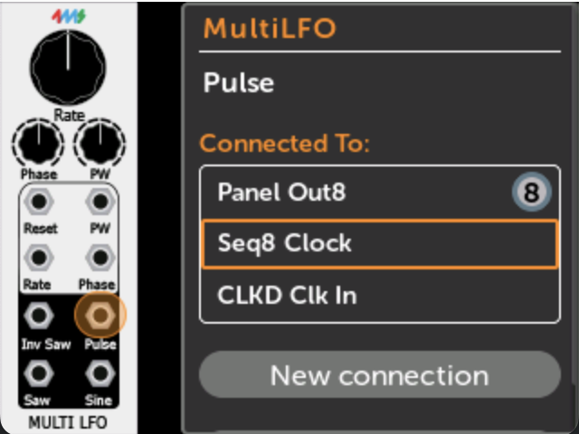

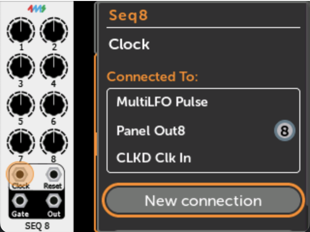
