# ノブの使い方

## ノブとジャックのマッピングを表示する方法

ボタンバーのノブアイコンをクリックすると、ノブマッピングが表示されます。

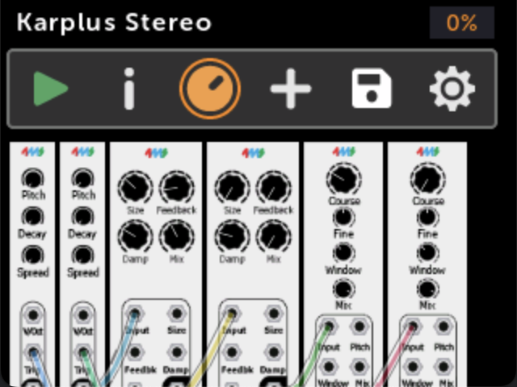

パッチの再生中に物理ノブを回すと、画面上でリアルタイムのビジュアルフィードバックが表示されます。

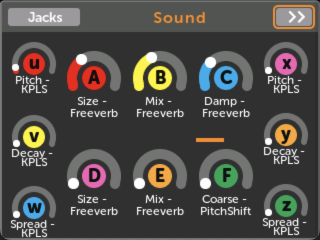

Jacksボタンをクリックすると、ジャックマッピング情報が表示されます。

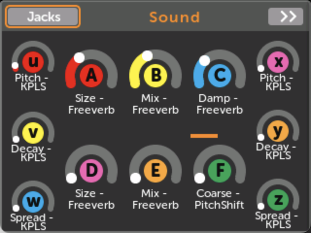

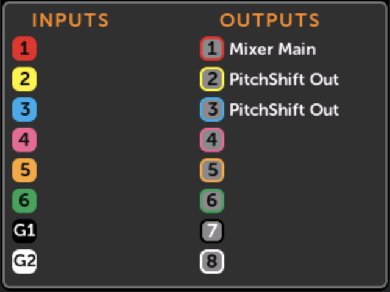

## ノブセット

「ノブセットは、ノブマッピングのグループです。各ノブセットは、12個の物理ノブを仮想モジュールコントロールにマッピングします。」システムはパッチごとに最大8つのノブセットをサポートしますが、一度にアクティブになるのは1つだけです。個々の物理ノブは、最大8つの仮想パラメータを同時に制御できます。

**ナビゲーション機能：**

- `>>` ボタンを使用してノブセット間を移動
- `Use` をクリックしてノブセットをアクティブ化

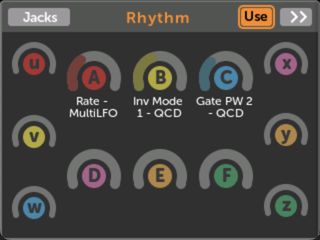

- Backボタンを押しながらエンコーダーを回すと素早く切り替え可能
- Backボタンの色は現在のノブセット番号（1-8）を示します

## ノブセットの作成と管理

新しいノブセットは以下の方法で作成できます：

- VCV Rackパッチ作成時
- マッピング設定時の「(new knobset)」オプション
- モジュールアクションメニューのAuto-map機能

ノブセット名は、名前フィールドをクリックしてテキストを入力することで編集できます。

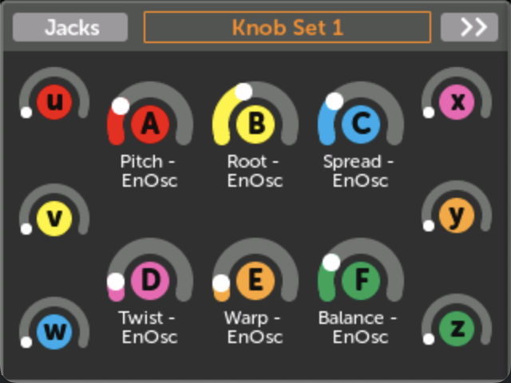

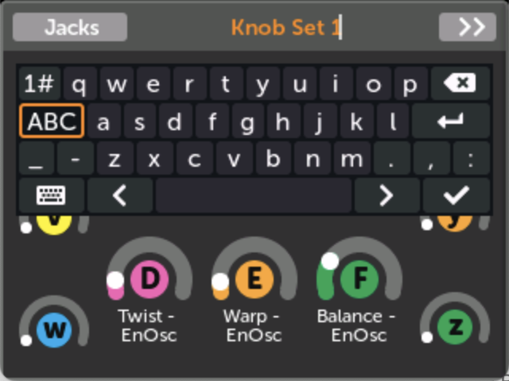

## ノブ/MIDIマッピングの作成

**基本プロセス：**

1. モジュールを開いてコントロールをクリック

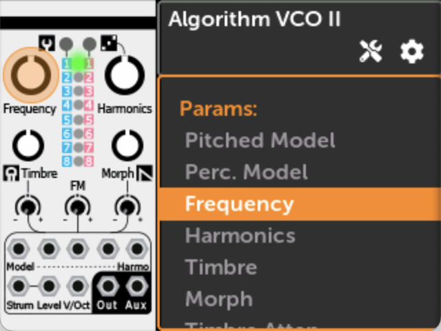

2. ノブセットを選択するか、「(new knobset)」を選択

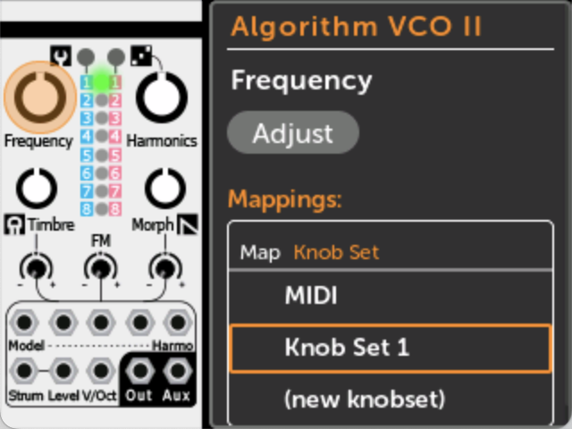

3. 物理ノブを動かしてマッピングを確立

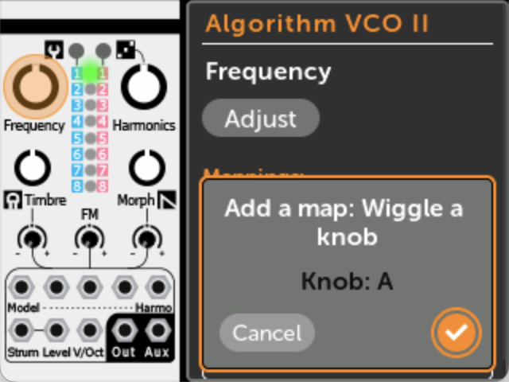

4. OKをクリックして確認

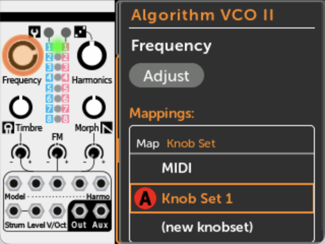

**クイックマップショートカット：** ロータリーエンコーダーを押し続けながらノブを動かすと、アクティブなノブセットに即座にマッピングされます。

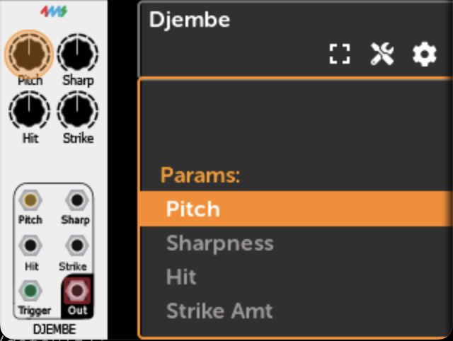

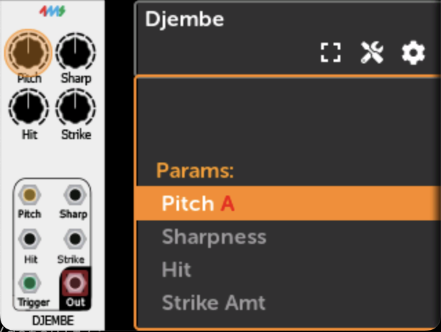

**削除ショートカット：** ロータリーを押しながらBackボタンをタップするとマッピングが削除されます。

## マッピングの編集

ノブビューページから、以下の操作が可能です：

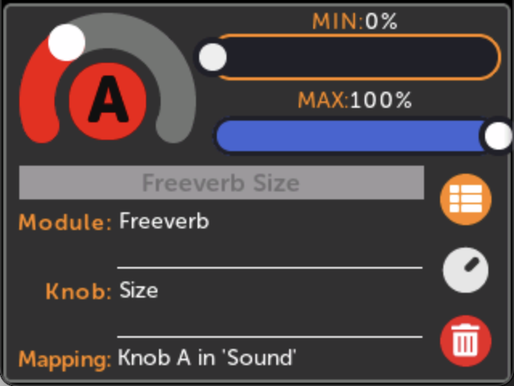

- MINとMAXの範囲値を調整

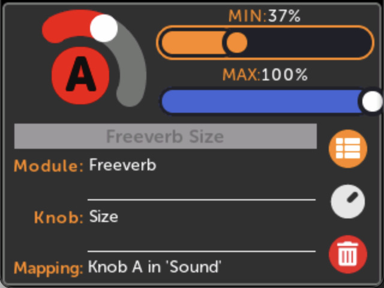

- コントロール方向を反転（MAXをMINより小さく設定）
- マッピング用のカスタムエイリアスを作成

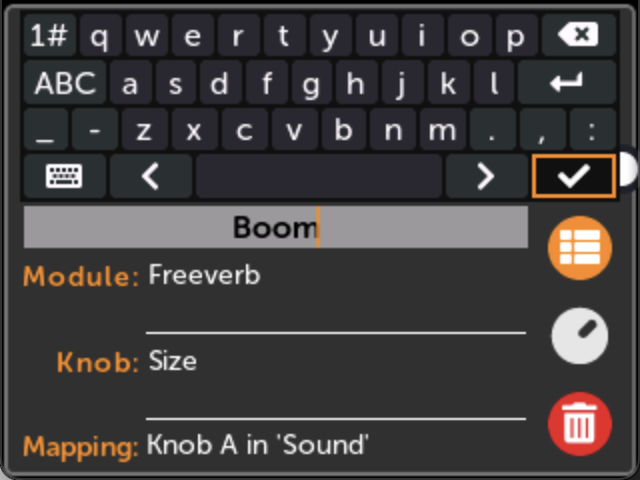

## マルチマップ

マルチマップを使用すると、1つの物理ノブで複数の仮想パラメータを同時に制御できます。既にマッピングされている物理ノブを新しいパラメータにマッピングすると、自動的に作成されます。

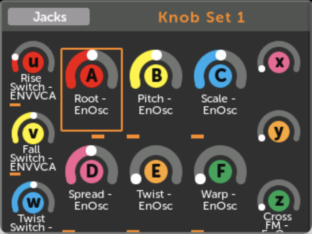

**マルチマップの表示：**

ノブセットページでは、複数のマッピングを持つノブの下にスクロールバーが表示され、接続されているすべてのパラメータを水平スクロールで表示できます。

**容量：** 8ノブセット × 12ノブ × 1ノブあたり8マッピング = パッチあたり768の仮想ノブ接続が可能です。
