# MIDIの使い方

## 概要

このドキュメントでは、パラメータマッピング、入出力ジャッキング、フィードバック機能を含むMetaModuleのMIDI機能について説明します。

## パラメータへのMIDIマップ

MIDI CCまたはNote Gateのオン/オフイベントを、ノブ、スイッチ、ボタンなどのパラメータにマッピングできます。

**クイックMIDIマップショートカット：**

- モジュールアクションメニューからMIDI Assignモードを有効化

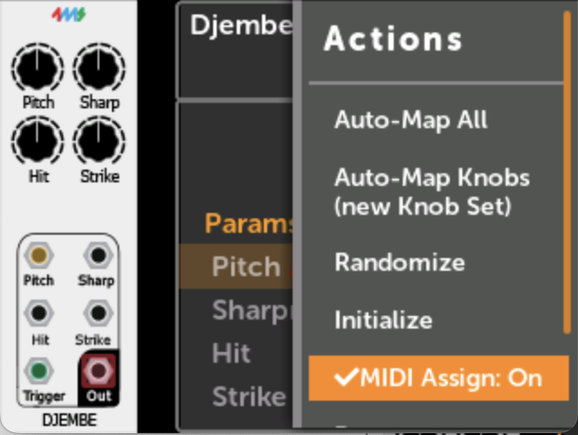

- 目的のパラメータにスクロール

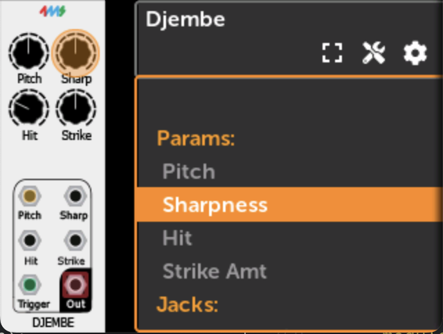

- 「ロータリーを押し続けながらMIDI CCまたはNoteを送信」
- マッピングが即座に適用されます

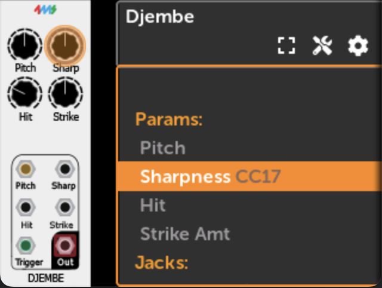

ロータリーを押しながらBackボタンをタップすると削除されます。

**マッピングの動作：**

パラメータ値はMIDI受信時に即座に更新され、Knob Catchupモードとは独立しています。

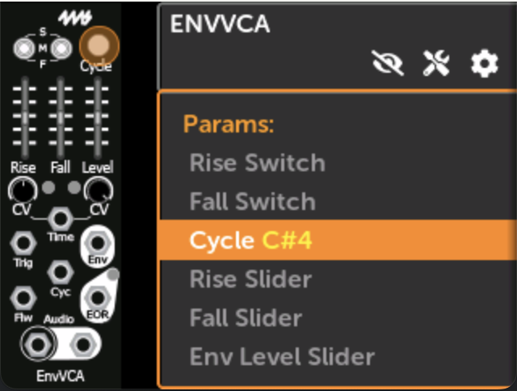

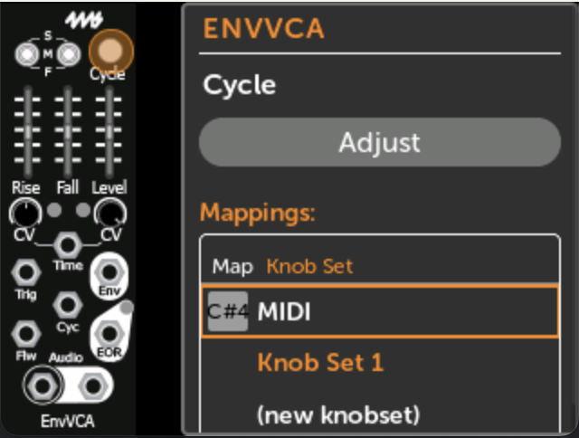

各マッピングはすべてのチャンネルまたは特定のチャンネルに応答できます。

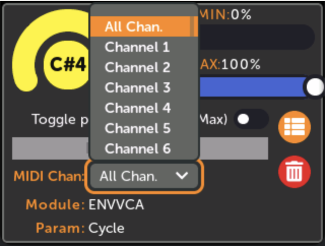

MIN/MAXスライダーで範囲を定義します。CC値0はMINに、127はMAXにマッピングされます。

**MIDI Note Gateトグルモード：**

- _トグル有効：_ 各Note OnでMIN/MAX値を切り替え

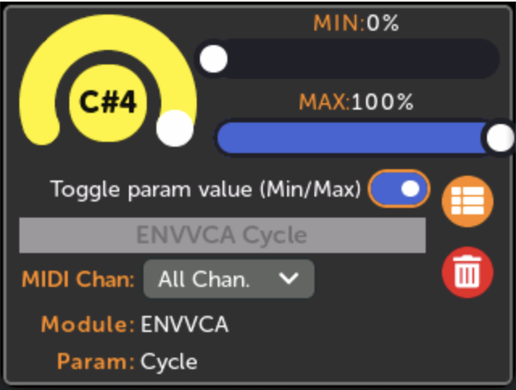

- _トグル無効：_ Note OnでMAXを設定、Note OffでMINを設定

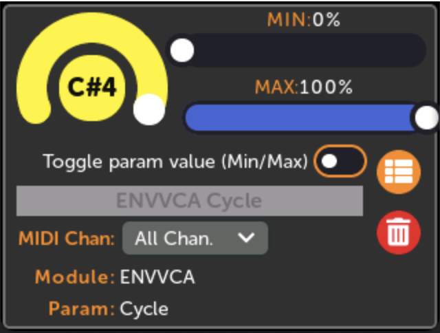

## MIDI入力ジャック

2つのパッチ方法があります：直接MIDIマッピングまたはMIDI-CVモジュール。

**直接マッピングオプション：**

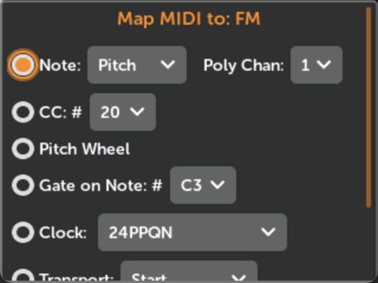

- Noteイベント（Pitch、Gate、Velocity、Aftertouch、Retrigger）
- コンティニュアスコントロール（CC、0V-10Vスケーリング）
- ピッチホイール

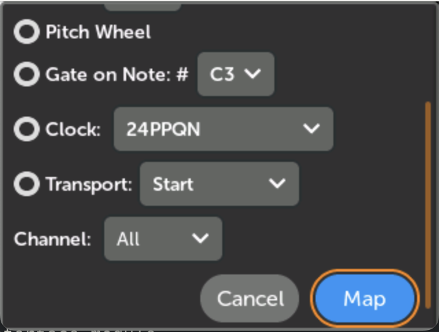

- 特定のNoteでのGate
- クロック（生の24PPQNまたは分周）
- トランスポート（Start、Stop、Continue）

**代替方法：**

従来のパッチングにはRackCore MIDIToCVInterfaceモジュールを使用します。

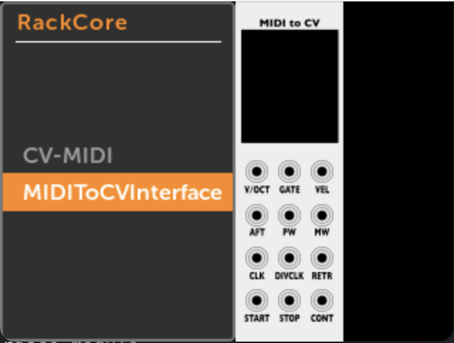

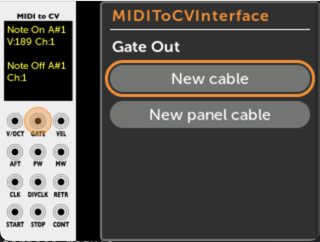

## 出力をMIDIにパッチ

「MetaModuleにはRackCoreブランドのCV-MIDIモジュールがあります」MIDI出力用です。

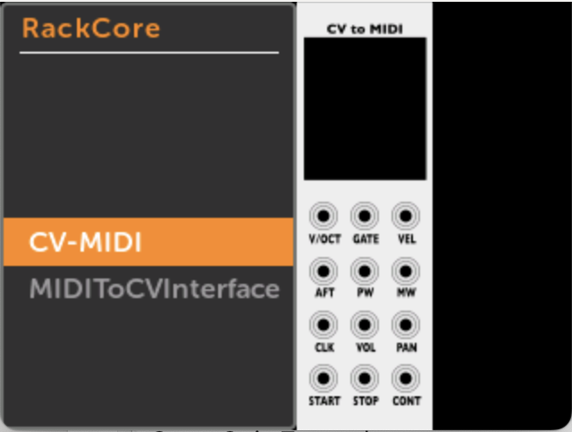

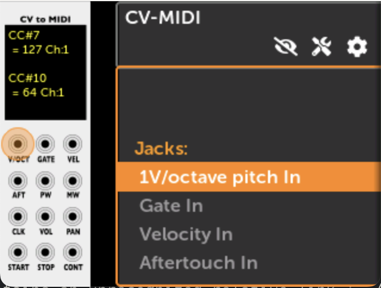

注意：MetaModuleはMIDIホストとしてのみ機能し、デバイスとしては機能しません。

## すべてのMIDIマッピングを表示

ノブセットページ（ノブアイコン）→ MIDIボタンからアクセスすると、ジャックマッピングとパラメータマッピングの両方が表示されます。

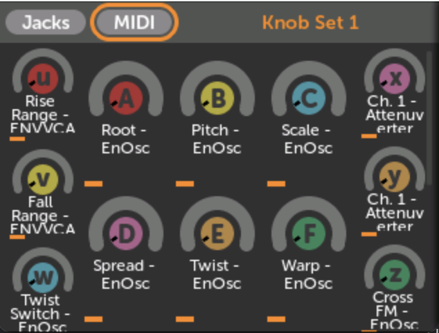

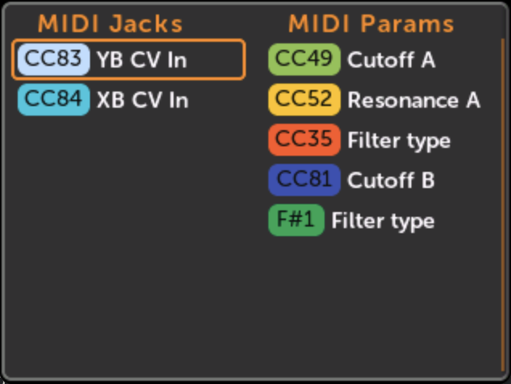

## MIDIフィードバック

コントローラーとMetaModule間の双方向同期を有効にします。有効にすると、パラメータが変更されたときにCC、ピッチホイール、Noteメッセージがコントローラーに送り返されます。「パッチの再生を一時停止して再開するだけで」すべての値を再送信できます。

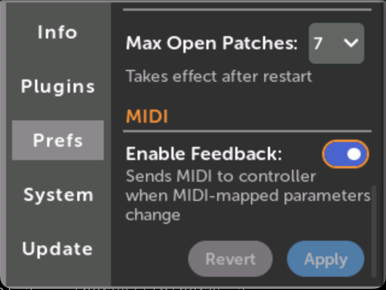

**デフォルト状態：** ファームウェアv2.0.9以降で有効。Settings > Prefs > MIDIで設定します。
