# VCV Rackの使い方

## 概要

VCV Rackは「バーチャルEurorackスタジオ」として説明されており、Mac、Windows、またはLinuxで動作し、何千もの無料モジュールが利用可能です。マニュアルには「VCV RackはVCVが所有・管理しており、4ms Companyとは提携していません」と記載されています。

コンピュータのVCV Rackでパッチを作成し、MetaModuleハードウェアに転送できます。

## インストールプロセス

### 4msモジュールのインストール手順：

1. **VCV Rack Libraryで購読** - 4ms Companyページにアクセスし、「Subscribe」をクリックしてすべてのモジュールを追加し、更新通知を受け取る

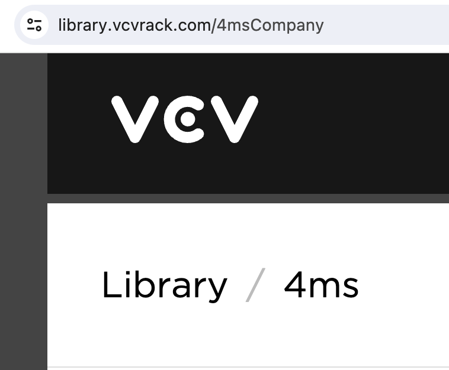

2. **ログインと更新** - VCV RackのLibraryメニューでアカウントにログインしていることを確認
3. **VCV Rackを再起動** - アプリケーションを終了して再起動
4. **モジュールにアクセス** - ラックの空きスペースを右クリックして4msモジュールを表示

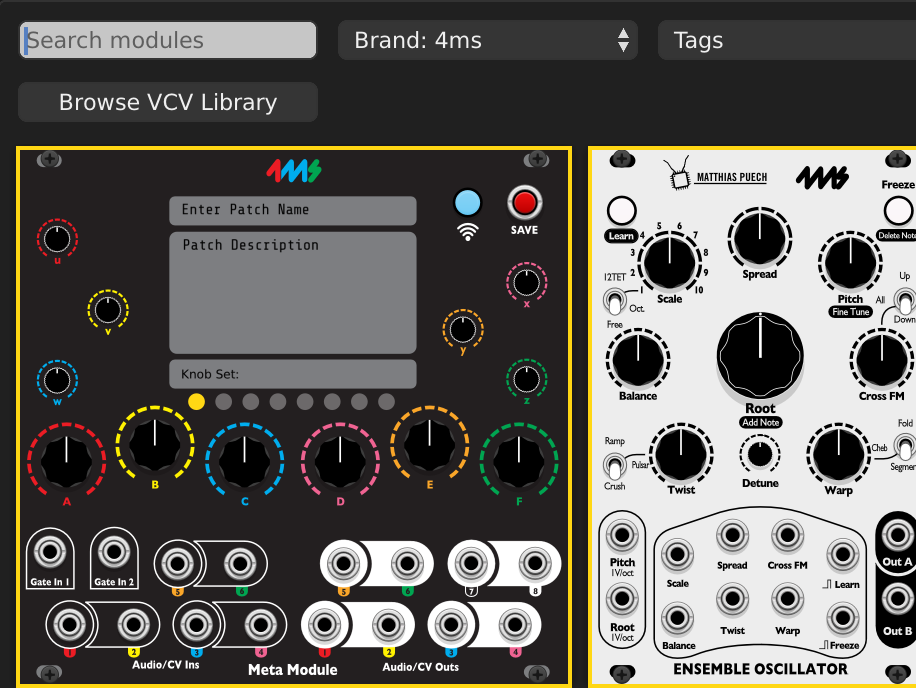

ベータテストや特別バージョン用に手動インストールも可能です。

## パッチ作成ワークフロー

### 主要ステップ：

1. **パッチを構築** - モジュールを追加し、パッチングして設定を構成

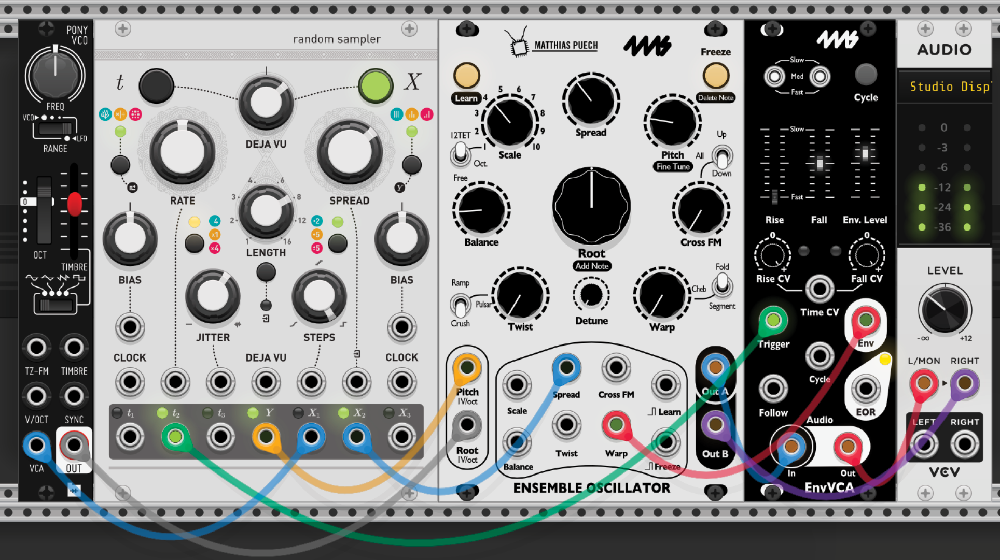

2. **MetaModule Hubを追加** - MetaModule Hubを検索してラックに追加

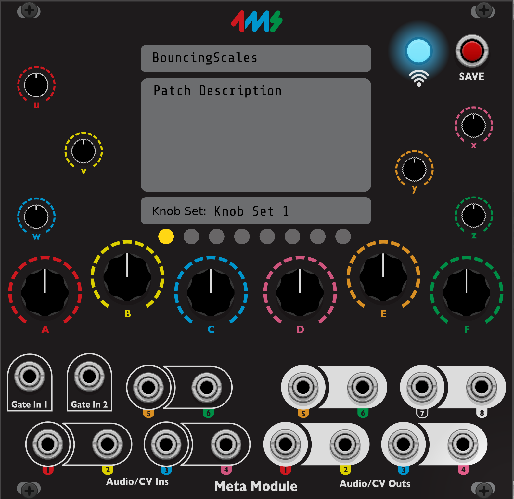

3. **ノブマッピングを作成** - MetaModuleノブ周りの色付きリングをクリックし、対象の仮想ノブ/コントロールをクリック

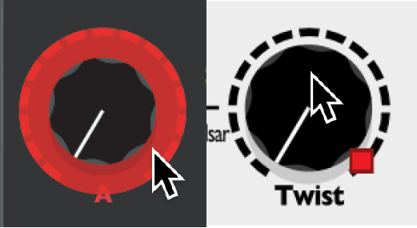

4. **ジャックマッピングを作成** - モジュール出力とMetaModuleジャック間でケーブルをドラッグ

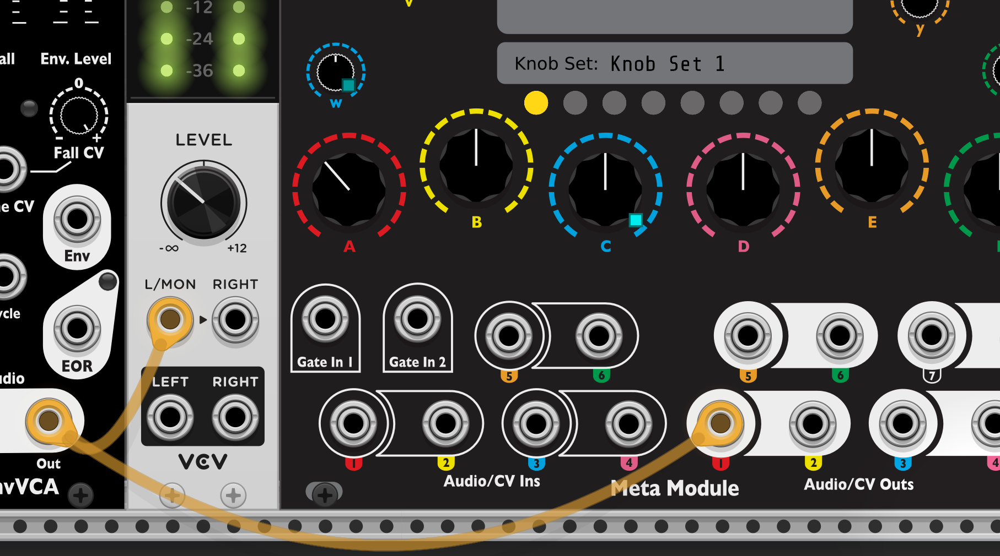

5. **.ymlファイルとして保存** - パッチはMetaModuleが読み取れる独自の形式で保存

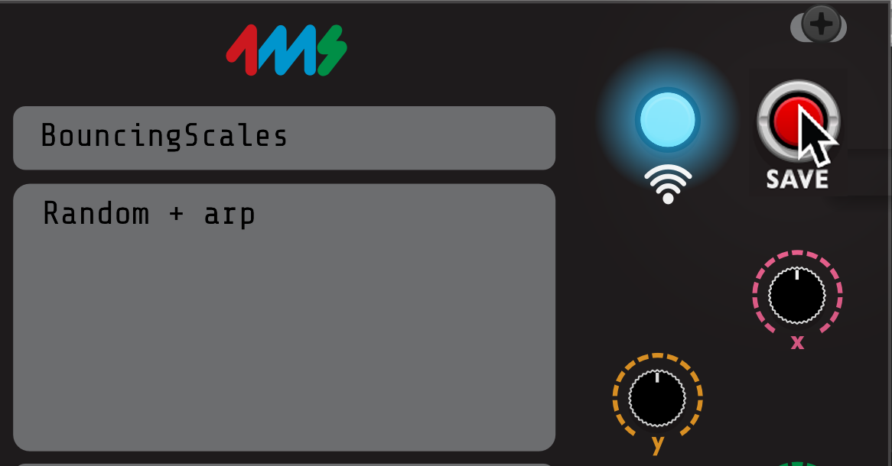

6. **MetaModuleにロード** - ストレージデバイスを挿入し、Patch Selectorからロード

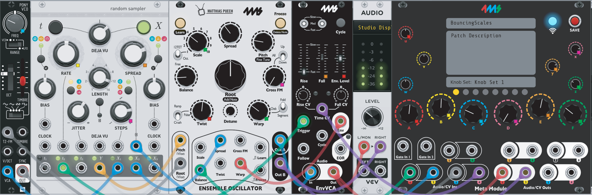

**注意：** 「VCV Rackパッチファイルは `.vcv` で終わり、MetaModuleでは読み取れません。」

## ノブセット

パッチごとに最大8つのノブセットを作成でき、12個のオンボードノブを使用してパッチ全体を制御できます。セットはMetaModule Hub上の黄色い円で選択でき、ハードウェア上に表示されるカスタム名を付けることができます。

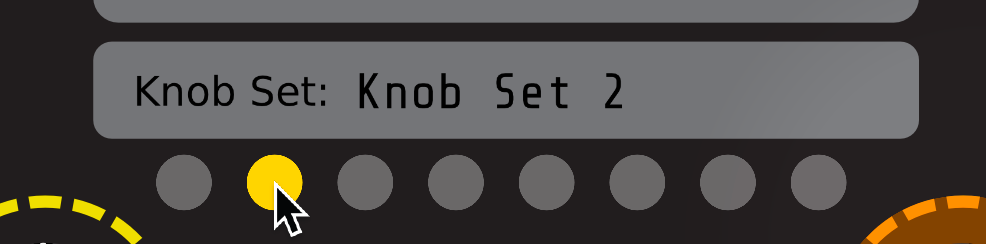

## ボタンマッピング

ボタンやスイッチもノブと同様にマッピングできます。

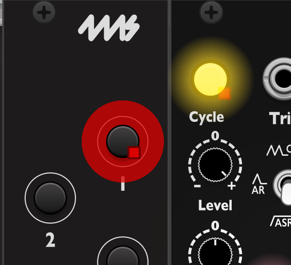

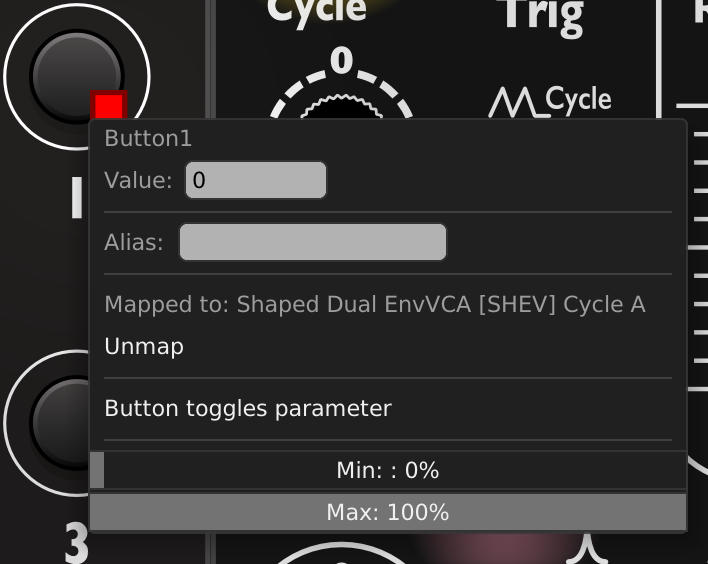

## MIDIマッピング

### サポートされているMIDI信号：

- ポリフォニックノート、ゲート、ベロシティ、アフタータッチ（最大16チャンネル）
- ピッチホイール、モッドホイール、クロック、分周クロック、リトリガー、スタート、ストップ、コンティニュー

### 重要な要件：

VCV内蔵のMIDI-CV、SPLIT、MIDI-Gate、MIDI-CC-CV、MIDI-CCモジュールを使用してマッピングを作成します。「これらのモジュールはMetaModuleにパッチをロードしても表示されません。MetaModuleにMIDIをどのようにマッピングしたいかを伝えるためだけに使用されます。」

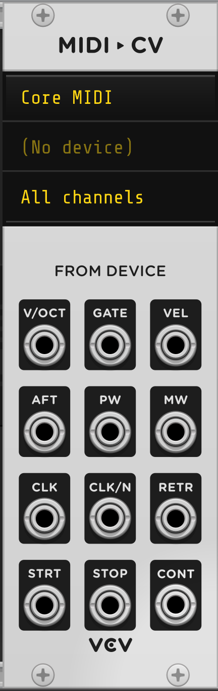

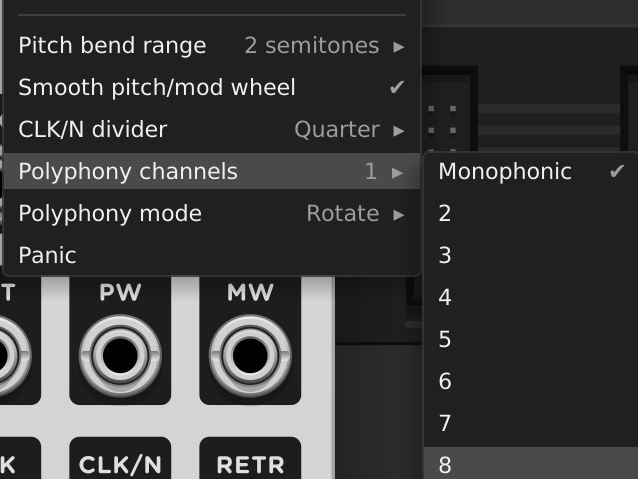

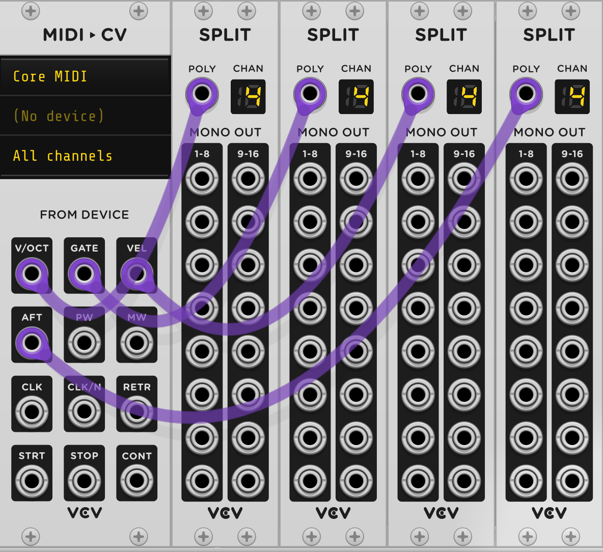

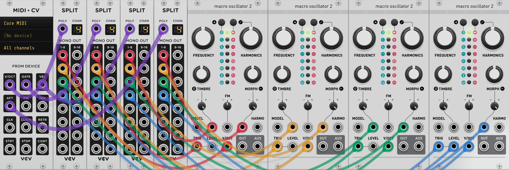

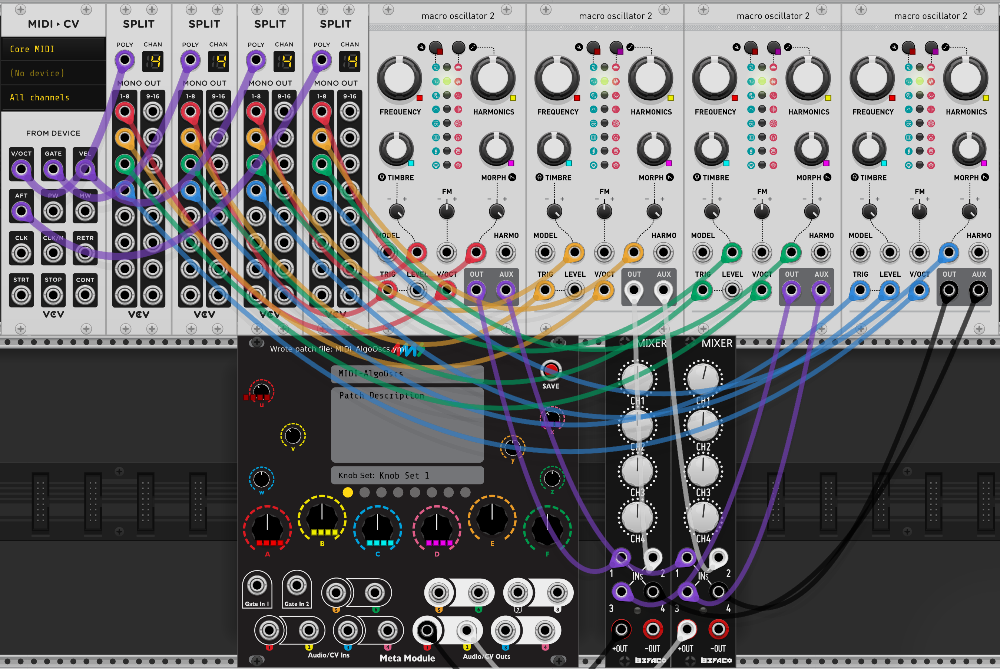

**MIDIノブマッピング：**

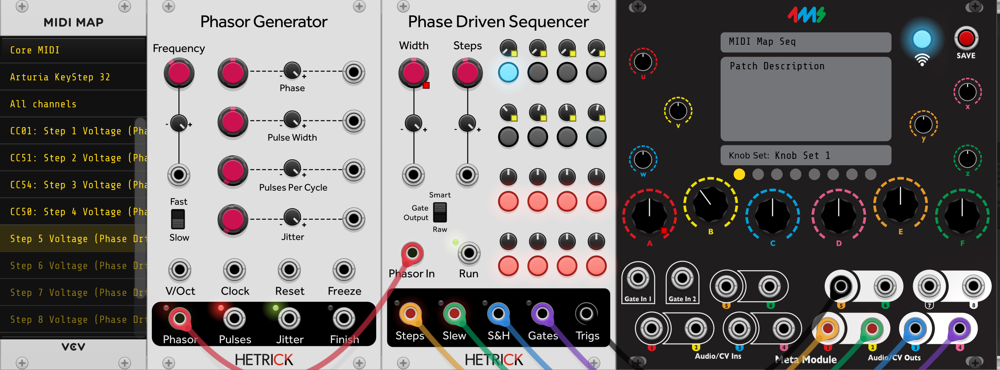

**MIDIゲートマッピング：**

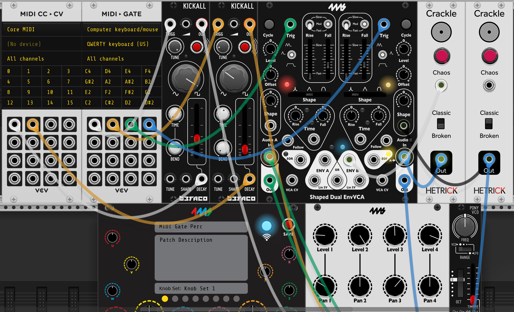

**その他のMIDIマッピング：**

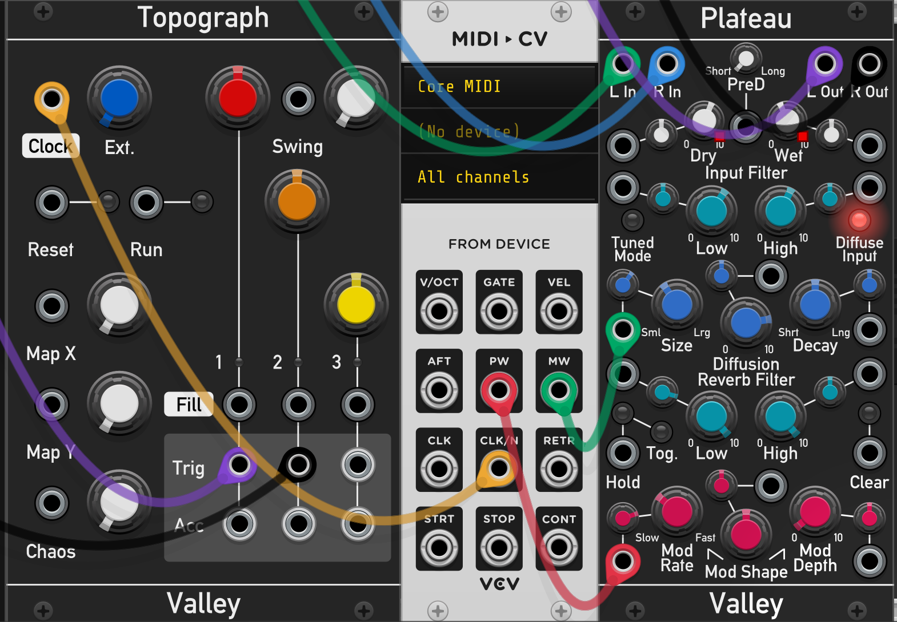

## マッピングの削除

マッピングを削除するには、マッピングを右クリックしてUnmapを選択します。

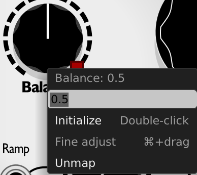

## パッチのロード

MetaModuleにパッチをロードするには：

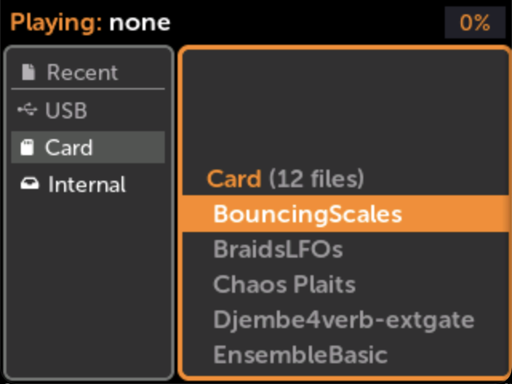

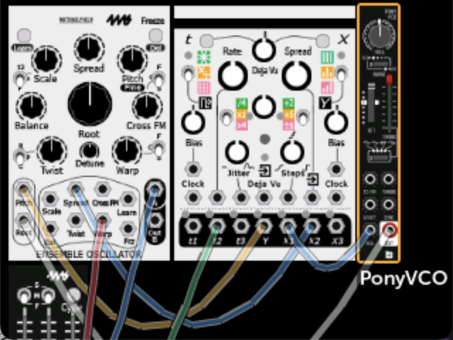

## 追加リソース

- [プラグイン互換性リスト](./plugins.md)
- [ダウンロード可能なサンプルパッチ](https://metamodule.info/dl/patches/)
- コミュニティスクリプト：4ms-MetaModule-Scripts（Python）互換モジュールを自動的に「Favorite」にタグ付け
