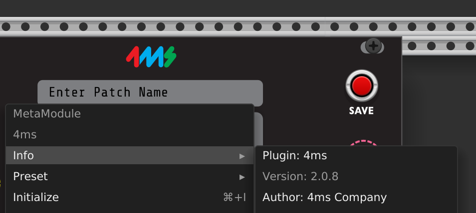

# バージョンと互換性

## 概要

ドキュメントでは、MetaModuleユーザーにとっての3つの主要なバージョンタイプについて説明しています：

1. **ファームウェアバージョン** - ハードウェア上で実行される低レベルソフトウェア
2. **プラグインバージョン** - サードパーティプラグインのアップデート（ファームウェアとは独立）
3. **SDKバージョン** - プラグインを実行するために必要な最小ファームウェア

## ファームウェアバージョン

メインメニューの設定でファームウェアバージョンを確認できます。最新バージョンはダウンロードページで入手可能です。

## プラグインバージョン

ガイドに記載されているように：「プラグインバージョンは、プラグイン開発者がプラグイン自体のアップデートを追跡するために使用されます。どのファームウェアバージョンが必要かとは関係ありません。」

ファームウェアv2.0以前は、プラグインバージョンはファームウェアバージョンに対応していましたが、2025年4月のアップデートで変更されました。

## 互換性ルール

セマンティックバージョニング（メジャー.マイナー.パッチ）を使用：

- **メジャーバージョン**はプラグインSDKとファームウェア間で一致する必要がある
- SDKの**マイナーバージョン**はファームウェア以下である必要がある
- **パッチバージョン**は互換性に影響しない

例：「SDK v1.2のプラグインはファームウェアv1.3.xまたはv1.2.xで実行できますが、ファームウェアv1.1.xでは実行できません」

## VCV Rackプラグインバージョン

4ms VCV Rackプラグインは別のバージョニングを持っています。ユーザーは常に最新バージョンをインストールする必要があります。これはすべてのファームウェアバージョンとの互換性を維持します（ただし、古いファームウェアでは一部の機能が利用できない場合があります）。

## 開発者向け

プラグインSDKバージョンは`.mmplugin`バンドル内の`SDK-X.X`ファイルに保存されており、プラグインのロード中に早期に互換性を確認できます。
