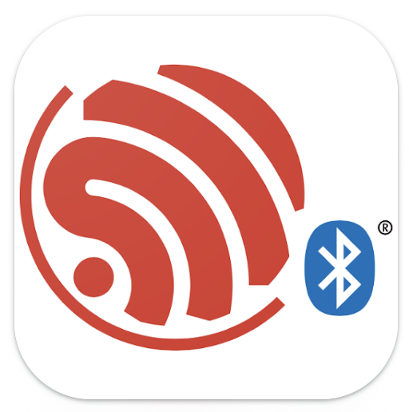
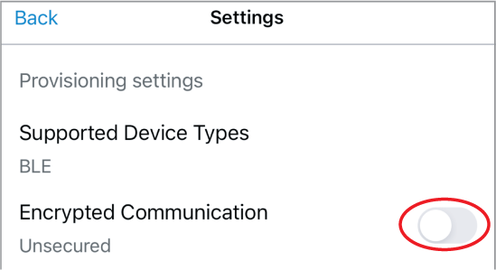
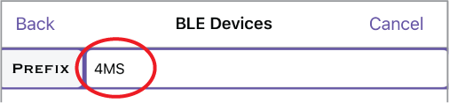
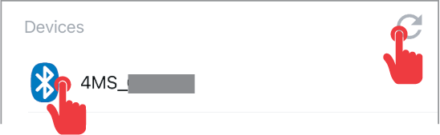
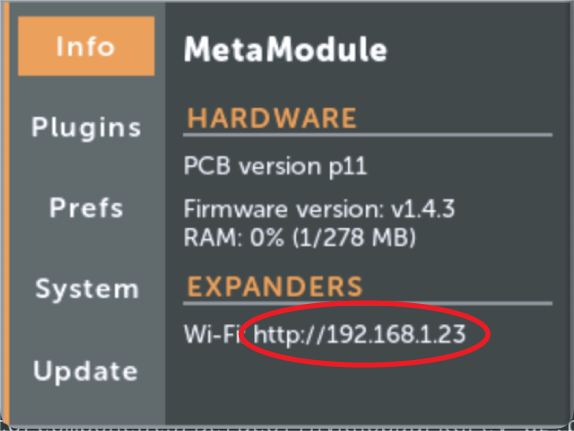
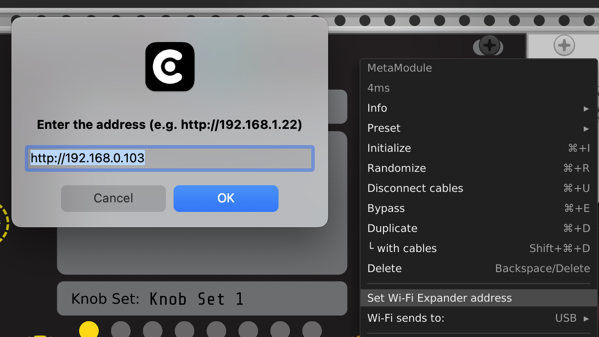
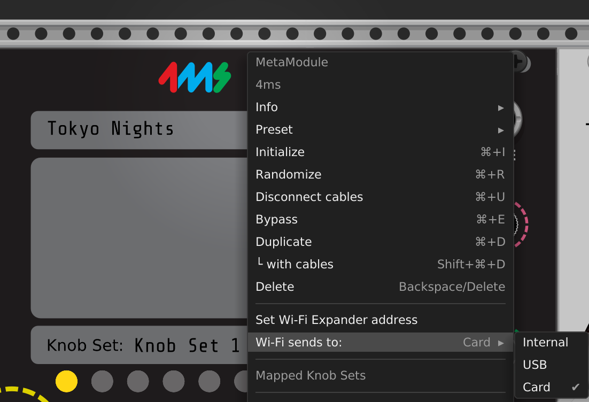
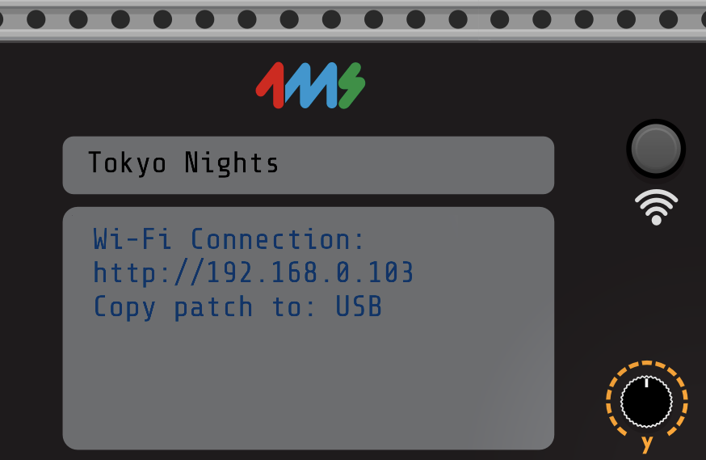

# Wi-Fiエクスパンダー

## 概要

Wi-Fiエクスパンダーは、パッチファイルの無線転送とVCV Rack統合のためのワイヤレス接続を可能にするMetaModuleのアクセサリモジュールです。

## セットアップ

### ハードウェア接続

1. システムの電源を切る
2. 8ピンケーブルをMetaModuleの「WiFi」ヘッダーとWi-Fiエクスパンダーに接続（両端とも赤いストライプを上に）
3. 10ピン電源ケーブルをEurorack電源に接続（赤いストライプを下に）
4. 電源を入れると、ボタンがライトブルーに点灯

### Wi-Fiネットワークプロビジョニング

セットアッププロセスには**ESP BLE Provisioningアプリ**（iOS App StoreまたはAndroid Google Play Store）を使用します：

**主なセットアップ手順：**

- アプリ設定で暗号化通信を無効化

- プレフィックスを「PROV\_」から「4MS」に変更

- デバイスをリフレッシュして検索

- プロビジョニングボタンをクリック

- 2.4GHzネットワークを選択してパスワードを入力
- 接続するとボタンが緑色に変わる

**インターフェースへのアクセス：**

MetaModuleでSettings > InfoをナビゲートしてWi-Fi IPアドレスを確認し、ブラウザでそのアドレスを`http://`（`https://`ではなく）で開きます。

## VCV Rackでの使用

4msプラグインv2.0.9以降が必要です。MetaModuleを右クリックして：

- Wi-Fiエクスパンダーアドレスを設定

- ターゲットボリュームを選択（制限のある内部ストレージよりUSB/Cardを推奨）

- Wi-Fiボタンで`.yml`パッチファイルを転送

## ステータスライトの色

| 色           | 意味                                     |
| ------------ | ---------------------------------------- |
| 赤           | プロビジョニングされていないか内部エラー |
| ライトブルー | 設定されたネットワークが見つからない     |
| 緑           | Wi-Fiに接続済み                          |

## ファームウェアアップデート

Wi-Fiエクスパンダーのファームウェアは、8ピンケーブルで接続中にMetaModuleファームウェアがアップデートされると自動的に更新されます（v1.4以降）。

## リセット

電源を入れながらボタンを押し続け、赤くなったらリリースし、再度プロビジョニングします。
